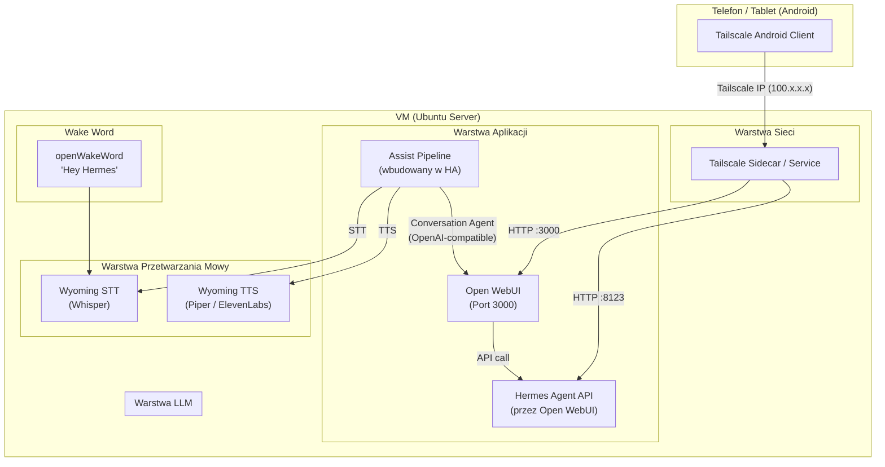
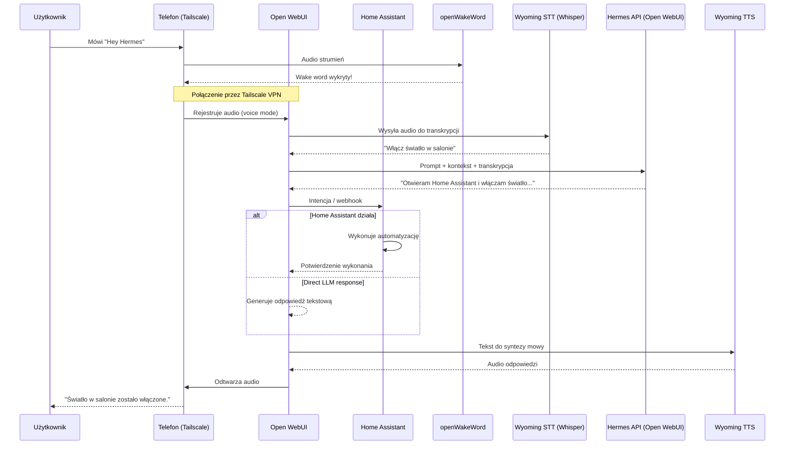

# Architektura Systemu — Hermes Voice Assistant

## Przegląd

Hermes Voice Assistant to system asystenta głosowego dla środowiska smart home, oparty na:
- **Open WebUI** jako interfejs czatu i voice mode
- **Home Assistant** jako centrum automatyki domowej
- **Tailscale** jako warstwa łączności VPN (Mesh VPN)
- **Wyoming STT/TTS** jako lokalne silniki rozpoznawania i syntezy mowy
- **Hermes Agent API** jako backend LLM (dostarczany przez Open WebUI)

---

## Diagram Komponentów

---

## Diagram Sekwencji — Przepływ "Hey Hermes"

---

## Opis Komponentów

### 1. Tailscale

**Rola:** Bezpieczna Mesh VPN łącząca urządzenia bez otwierania portów na routerze.

- Działa na VM (Ubuntu) jako `tailscaled` oraz na Androidzie jako aplikacja
- Każde urządzenie dostaje unikalny IP z zakresu `100.x.x.x` (Tailscale MagicDNS)
- Szyfrowanie end-to-end WireGuard
- Zero config — logowanie przez SSO (Google, GitHub, Microsoft)

**Porty:** Brak otwartych portów na firewallu — Tailscale używa UDP 41641 (outbound), NAT traversal.

### 2. Open WebUI

**Rola:** Główny interfejs użytkownika — czat, voice mode, zarządzanie konwersacjami.

- Nasłuchuje na porcie `:3000` (tylko w sieci Tailscale)
- Voice Mode: nagrywanie audio w przeglądarce/aplikacji → STT → LLM → TTS
- Możliwość podłączenia zewnętrznych API (ElevenLabs TTS, Whisper STT)
- Dostarcza endpoint OpenAI-kompatybilny `/api/chat/completions`

**Konfiguracja voice:**
- TTS: ElevenLabs (klucz API) lub Wyoming TTS (Piper, lokalny)
- STT: Whisper (lokalny przez Wyoming lub OpenAI Whisper API)
- Automatyczne wykrywanie ciszy (silence detection)

### 3. Home Assistant

**Rola:** Centrum automatyki domowej, egzekucja intencji, zarządzanie urządzeniami.

- Nasłuchuje na porcie `:8123`
- **Assist Pipeline:** wbudowany pipeline głosowy obsługujący STT → Intent Recognition → TTS
- **Conversation Agent:** integrator OpenAI-kompatybilny, łączy się z Open WebUI API
- Obsługuje intencje: włącz/wyłącz światło, ustaw temperaturę, blokada drzwi, itp.
- Integracja przez: webhooks, REST API, automatyzacje

### 4. Wyoming STT / TTS

**Rola:** Lokalne, prywatne przetwarzanie mowy bez wysyłania danych do chmury.

- **STT (Speech-to-Text):** Whisper (modele small/medium/large) — konwersja mowy na tekst
- **TTS (Text-to-Speech):** Piper — szybka, lekka synteza mowy (działa na CPU)
- Protokół Wyoming: standard Home Assistant do komunikacji z serwisami mowy
- Alternatywnie: ElevenLabs TTS (chmurowy, wyższa jakość) przez Open WebUI

### 5. Hermes Agent API / Open WebUI LLM

**Rola:** Backend LLM — generowanie odpowiedzi, rozumienie intencji, wykonywanie akcji.

- Uruchomiony jako model przez Open WebUI (lub zewnętrzny API)
- Obsługuje: czat konwersacyjny, tool calling, RAG, code execution
- Komunikacja przez REST API (OpenAI-compatible)

---

## Przepływ Danych — Krok po Kroku

### Scenariusz: Użytkownik mówi "Hey Hermes, włącz światło w salonie"

1. **Wake Word Detection** — `openWakeWord` na telefonie nasłuchuje frazy "Hey Hermes". Po wykryciu aktywuje voice mode w Open WebUI.

2. **Nagrywanie audio** — Telefon nagrywa komendę głosową przez mikrofon.

3. **Transmisja przez Tailscale** — Audio + metadane są wysyłane przez szyfrowany tunel WireGuard do VM.

4. **STT (Speech-to-Text)** — Open WebUI wysyła audio do Wyoming STT (Whisper), który zwraca tekst: "włącz światło w salonie".

5. **LLM Processing** — Tekst trafia do Hermes API (Open WebUI `chat/completions`). Model interpretuje intencję: `{action: "turn_on", entity: "light.living_room"}`.

6. **Egzekucja intencji** — Open WebUI wywołuje Home Assistant REST API lub webhook, który wykonuje automatyzację/service `light.turn_on`.

7. **Generowanie odpowiedzi** — LLM generuje naturalną odpowiedź: "Już włączam światło w salonie."

8. **TTS (Text-to-Speech)** — Odpowiedź tekstowa trafia do Wyoming TTS (Piper) lub ElevenLabs, który generuje audio.

9. **Odtwarzanie** — Audio jest strumieniowane z powrotem przez Tailscale na telefon i odtwarzane użytkownikowi.

---

## Bezpieczeństwo

- **Brak otwartych portów** — wszystko przez Tailscale Mesh VPN
- **Szyfrowanie** — WireGuard (Tailscale) + HTTPS (jeśli skonfigurowane)
- **Autoryzacja** — Open WebUI: JWT token; Home Assistant: Long-Lived Access Token
- **Izolacja** — Usługi nasłuchują tylko na `tailscale0` / `127.0.0.1`

## Wymagania Sprzętowe

| Komponent | Minimalne |
|-----------|-----------|
| CPU | 2 vCPU (x86_64) |
| RAM | 4 GB |
| Dysk | 20 GB SSD |
| Sieć | Tailscale (WireGuard) |
| System | Ubuntu 22.04+ / Debian 12+ |